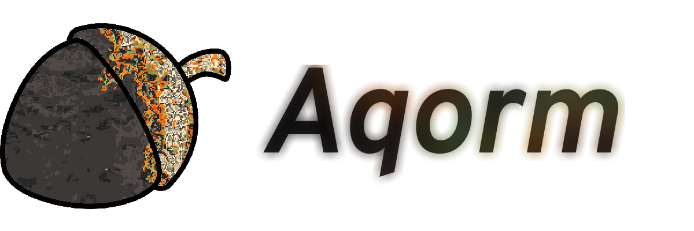
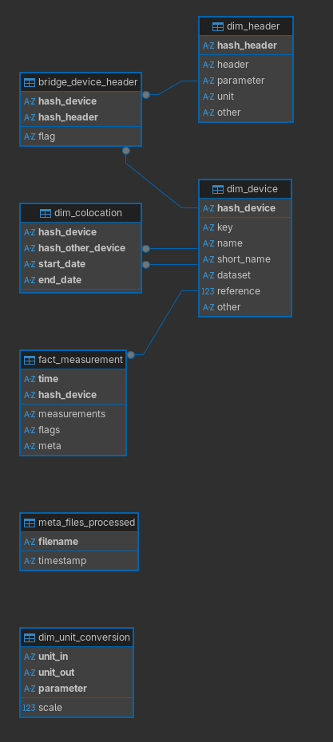

<div align="center">
    
</div>


**Documentation**: https://caderidris.github.io/aqorm/

**Contact**: [id.hayward@caegeidwad.dev](mailto:id.hayward@caegeidwad.dev)


[](https://github.com/CaderIdris/aqorm/actions/workflows/tests.yml)

---

## Table of Contents

1. [Summary](##summary)
1. [Installation](##how-to-install)
1. [Schema](##schema)
1. [Development](##development)
1. [Extra](##extra)

---

## Summary

The Aqorm schema is used across multiple of my projects to represent low-cost air quality sensor measurements.
It allows the aggregation of measurements from multiple sources into a consistent data format.
It is separated into its own package for portability.

Supports SQLite3, DuckDB and PostgreSQL out of the box.

---

## Installation

```bash
pip install aqorm
```

---

## Schema

#### dim_device

This table contains information relevant to each device.

|Column|Type|PK|Unique|Nullable|Description|
|---|---|---|---|---|---|
|key|VARCHAR|Y|Y|N|The key used for the device in the measurements table, used to relate the two tables|
|name|VARCHAR|N|Y|N|The full name of the device|
|short_name|VARCHAR|N|Y|N|A short name for the device, to be used in places such as graph axis labels where space is a premium|
|dataset|VARCHAR|N|N|N|Which dataset the device came from|
|reference|BOOLEAN|N|N|N|Will this device be used as a reference or reference equivalent device?|
|other|JSON|N|N|Y|Any other information, stored as a json for flexibility|

#### dim_header

This table contains information relevant to each measurement header.

|Column|Type|PK|Unique|Nullable|Description|
|---|---|---|---|---|---|
|header|VARCHAR|Y|Y|N|The measurement header (column name in the measurement csvs)|
|parameter|VARCHAR|N|N|N|The parameter the measurement represents (i.e. NO2, T)|
|unit|VARCHAR|N|N|N|The unit of measurement (e.g. nA, %)|
|other|JSON|N|N|Y|Any other information, stored as a json for flexibility|

#### bridge_device_headers

This table contains headers corresponding to a measurement made by a device.

|Column|Type|PK|Unique|Nullable|Description|
|---|---|---|---|---|---|
|device_key|VARCHAR|Y|N|N|The device key that made the measurements|
|header|VARCHAR|Y|N|N|The header corresponding to a measurement|
|flag|VARCHAR|N|N|N|Any flag associated with the measurement|

###### Constraints

`device_key` must be a PK in the `dim_device` table.

`header` must be a PK in the `dim_header` table.

#### dim_unit_conversion

Information on how to convert from one unit of measurement to another.
May not be useful for anything more than reference, but could be used to automate standardisation of reference measurements (some are in ppb, some in μgm-3).

|Column|Type|PK|Unique|Nullable|Description|
|---|---|---|---|---|---|
|unit_in|VARCHAR|Y|N|N|The initial unit of measurement (i.e. ppb)|
|unit_out|VARCHAR|Y|N|N|The resulting unit of measurement (i.e. μgm-3)|
|parameter|VARCHAR|Y|N|N|What parameter the unit of measurement represents (i.e. NO2, O3)|
|scale|FLOAT|N|N|N|Value to multiply the measurements by for conversion|

#### fact_measurement

All measurements made by both low-cost sensors and reference devices.
The measurement columns are json to maximise flexibility, but this may come at the cost of performance.

|Column|Type|PK|Unique|Nullable|Description|
|---|---|---|---|---|---|
|time|DATETIME|Y|N|N|The time the measurement was made|
|device_key|VARCHAR|Y|N|N|The device that made the measurement|
|measurements|JSON|N|N|N|The measurements|
|flags|JSON|N|N|Y|The flags corresponding to the measurement|
|meta|JSON|N|N|Y|Any other metadata related to the measurement|

###### Constraints

`device_key` must be a PK in the `dim_device` table.

#### dim_colocation

Periods where a device was co-located with another.

|Column|Type|PK|Unique|Nullable|Description|
|---|---|---|---|---|---|
|device_key|VARCHAR|Y|N|N|The co-located device|
|other_key|VARCHAR|Y|N|N|The reference device|
|start_date|DATETIME|Y|N|N|The start of the co-location|
|end_date|DATETIME|Y|N|N|The end of the co-location|

###### Constraints

`device_key` must be a PK in the `dim_device` table.

`other_key` must be a PK in the `dim_device` table.

#### meta_files_processed

Which files have already been processed?

|Column|Type|PK|Unique|Nullable|Description|
|---|---|---|---|---|---|
|filename|VARCHAR|Y|Y|N|The file that has been processed|
|timestamp|DATETIME|N|N|Y|The time it was processed|


*DB Diagram generated by DBeaver*


---

## Development

This code is fully unit tested, with 100% coverage.
It also undergoes a suite of static tests and linting.

Of particular note are the DB tests in [test_orm.py](./tests/test_orm.py), which test all of the unique and foreign key constraints in each table for each DB, ensuring they all behave as intended.
This is especially important for SQLite which has some weird behaviour, particularly as it doesn't strictly enforce foreign key constraints by default.
It also means that behaviour shouldn't deviate depending on which DB the user chooses to use.

---

## Extra

### Connection String

The connection string corresponds to a [SQLAlchemy connection string](https://docs.sqlalchemy.org/en/20/core/engines.html#database-urls).
The three supported options are:

|DB|String prefix|
|---|---|
|DuckDB|`duckdb://`|
|SQLite|`sqlite+pysqlite://`|
|PostgreSQL|`postgresql+psycopg://`|

Other DBs are unsupported but may work if you install the required packages.

